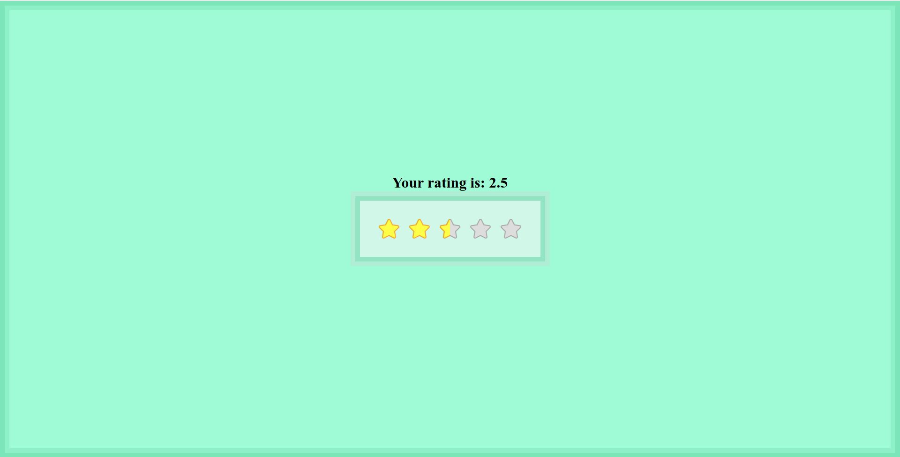

# React stars rating app
> app created using React, sass, animations created with anime.js
## See it live
[React stars rating app live on github](https://daliborkoenig.github.io/react-stars-rating-app/)
## App Info
practicing working with offset in a react enviroment

- you can hover and set temporary rating
- once you click you have set the rating and textual rating will appear

### Author
Dalibor Koenig
### Version
1.0.5
### License
This project is licensed under the MIT License

